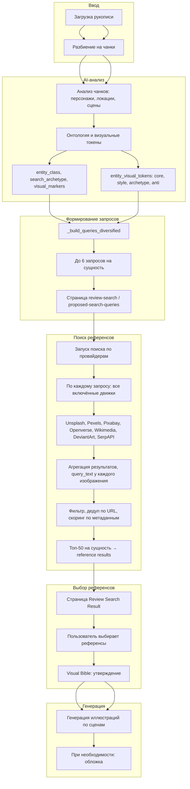

# Визуальный пайплайн YRead

Документ описывает полный поток от рукописи до иллюстраций: загрузка, AI-анализ, онтология и визуальные токены, формирование поисковых запросов, поиск референсов и генерация иллюстраций.

---

## Зачем несколько поисковых запросов на персонажа/локацию (4–6)

На эндпоинте `/books/:id/review-search` (и при вызове поиска референсов) для **каждой** сущности (персонаж или локация) формируется **не одна**, а **4–6 семантически разных** поисковых строк. Причины:

1. **Разные семантики** — один запрос не может одинаково хорошо покрыть и «как выглядит персонаж», и «в каком стиле искать», и «каноническое имя для известных книг».
2. **Диверсификация результатов** — несколько запросов дают разнообразные картинки: по архетипу, по визуальным маркерам, по каноническому имени, по токенам, по адаптациям, по контексту книги.
3. **Покрытие движков** — разные провайдеры (Unsplash, Pexels, Pixabay, SerpAPI и др.) лучше отвечают на разные формулировки; агрегация по всем запросам и движкам даёт лучший пул референсов.

Формирование запросов реализовано в `backend/app/services/search_service.py` в функции `_build_queries_diversified`. Ниже — описание каждого из 6 слотов.

---

## Слоты запросов в `_build_queries_diversified`

| Слот | Назначение | Источники данных |
|------|------------|------------------|
| **Q1** | Онтологический архетип / известная сущность / описание | `ontology.search_archetype`, `ontology.anti_human_override`, `canonical_search_name` (для известных), иначе `description[:80]` + суффикс; добавляется `style_category`. |
| **Q2** | Визуальные маркеры | До 4 элементов из `ontology.visual_markers` + суффикс: для не-человека — `entity_class`, для персонажа — `_character_suffix(visual_type)` (man/woman/animal/AI/alien/creature portrait). |
| **Q3** | Каноническое имя или визуальный аналог | `search_visual_analog[:100]` или для известной сущности — `canonical_search_name` + «illustration». |
| **Q4** | Токены (ядро + архетип) | До 3 `core_tokens` + до 2 `archetype_tokens` из `entity_visual_tokens` + `style_category`. |
| **Q5** | Адаптации (фильм/ТВ) | Только для известных книг: до 2 элементов из `known_adaptations` + «character still» / «location still»; такие запросы принудительно идут через SerpAPI. |
| **Q6** | Контекст книги | Для известных книг: `well_known_book_title` + `author` + «character illustration» / «book illustration». |

К каждому запросу при необходимости добавляется `style_category` книги (fiction, sci-fi, romance и т.д.). Для персонажей суффикс от `visual_type` задаётся через `_character_suffix` (man/woman portrait, animal, AI, alien, creature). Итоговое количество запросов ограничено 6 (`queries[:6]`).

---

## Диаграмма полного визуального пайплайна

**Точки, где формируются запросы:** в сервисе `search_service.py` — при вызове `get_proposed_search_queries` (для страницы предложенных запросов) и внутри `search_references_for_book` при вызове `_get_queries_for_entity` → `_build_queries_diversified` (или `_build_queries` как fallback).

**Точки, где выбираются движки:** в `search_references_for_book` — через `_get_providers_for_entity` → `engine_selector.select_engines` (по умолчанию до 2 провайдеров на сущность); при агрегирующем режиме по каждому запросу вызываются все включённые провайдеры, результаты объединяются и ранжируются.

---

## Краткий поток по этапам

1. **Загрузка рукописи** — пользователь загружает текст (например, из Google Drive).
2. **Разбиение на чанки** — бэкенд режет текст на чанки для анализа.
3. **AI-анализ** — из чанков извлекаются персонажи, локации и сцены; для сущностей строятся онтология (`entity_class`, `search_archetype`, `visual_markers`, `anti_human_override`) и визуальные токены (`core_tokens`, `style_tokens`, `archetype_tokens`, `anti_tokens`).
4. **Предложенные запросы** — для каждой сущности вызывается `_build_queries_diversified`, результат показывается на странице review-search (proposed-search-queries).
5. **Поиск референсов** — пользователь запускает поиск; по каждому запросу вызываются все включённые провайдеры; изображения получают `query_text`; выполняется фильтрация, дедупликация по URL и ранжирование по выравниванию с запросом; на одну сущность возвращается не более 50 изображений.
6. **Reference results** — пользователь видит результаты и выбирает референсы.
7. **Visual Bible** — утверждение выбора, сохранение в Visual Bible.
8. **Генерация иллюстраций** — по выбранным сценам и стилю генерируются иллюстрации (и при необходимости обложка).

Этот документ можно использовать для уточнения списка исправлений и доработок (в т.ч. п. 3 из Bugs and enhancements).

---

## Алгоритм формирования поисковой строки (детали)

**Источники полей:**

- **Онтология** (из AI-анализа): `entity_class`, `search_archetype`, `visual_markers`, `anti_human_override`.
- **Визуальные токены** (entity-level или агрегация по чанкам): `core_tokens`, `style_tokens`, `archetype_tokens`, `anti_tokens`.
- **Сущность:** `physical_description` / `visual_description`, `visual_type` (персонажи), `search_visual_analog`, `canonical_search_name`, `is_well_known_entity`.
- **Книга:** `style_category`, `is_well_known`, `well_known_book_title`, `author`, `known_adaptations`.

**Порядок приоритетов:**

- Для Q1: при `anti_human` — `search_archetype` + style; иначе при известной сущности — canonical + суффикс + style; иначе description[:80] + суффикс.
- Для Q3: приоритет `search_visual_analog` над canonical; для известных — canonical + «illustration».
- В fallback `_build_queries`: приоритет `search_visual_analog` над токенами над description.

**Лимиты длины:**

- `search_visual_analog`: до 100 символов в diversified, до 120 (12 слов) в простом варианте.
- `description`: до 80 символов в Q1/diversified, до 60 в fallback; в простом варианте до 80.
- `visual_markers`: до 4 элементов в Q2.

**Единообразное добавление style_category:** в `_build_queries_diversified` style_category берётся из `book_info["style_category"]` (по умолчанию "fiction") и добавляется в Q1, Q4 и в fallback; в `_build_queries` — ко всем запросам в конце.

**anti_tokens:** в текущей реализации не участвуют в формировании строки запроса; могут использоваться в будущем для исключения нежелательных стилей (например, минус-слова для провайдеров, которые их поддерживают).
