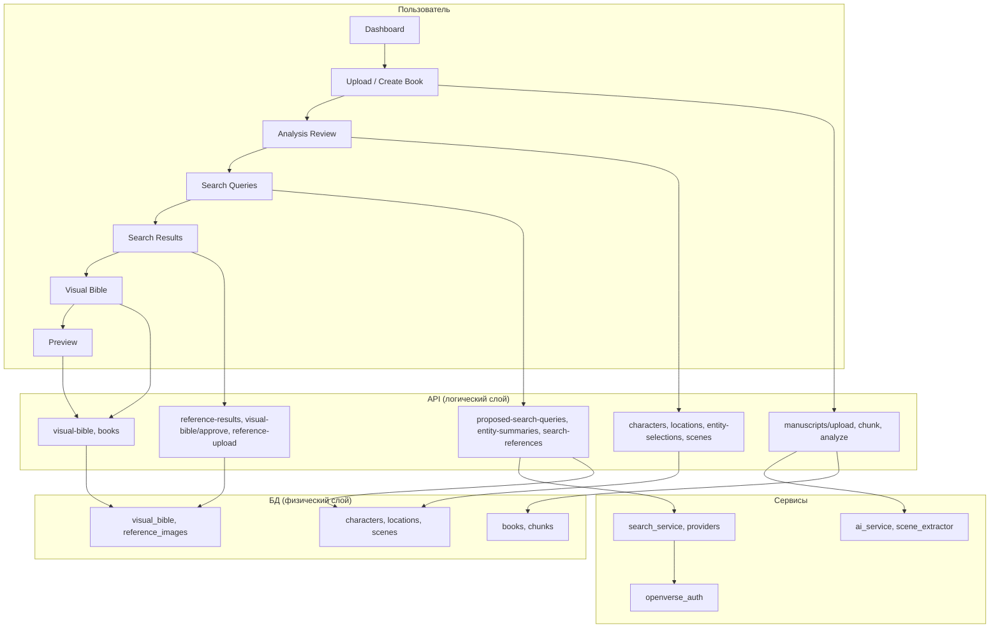

# YRead (StoryForge AI) — обзор приложения

Документ описывает полный охват приложения: пользовательский сценарий, концептуальный, логический, физический (БД) и технологический слои. Предназначен для обсуждения с командой разработки и планирования улучшений.

---

## 1. Пользовательский сценарий (User Journey)

Приложение — платформа для авторов: загрузка рукописи → AI-анализ → подбор референсных изображений для персонажей и локаций → формирование Visual Bible → превью книги и (в перспективе) генерация иллюстраций и обложек.

### 1.1 Маршруты и экраны

| Маршрут | Экран | Назначение |
|--------|--------|------------|
| `/` | **Home (Dashboard)** | Список книг; создание новой книги; переход к этапам workflow по выбранной книге. |
| `/settings` | **Settings** | Настройки: выбор провайдеров поиска референсов, API-ключи (через backend .env). |
| `/manuscript-upload` | **Create Book (Setup)** | Загрузка рукописи (файл / Google Drive), выбор жанра и стиля; после загрузки — запуск разбиения на чанки и опционально анализ. |
| `/books/:bookId` | **Workflow layout** | Обёртка с навигацией по этапам; по умолчанию редирект на `preview`. |
| `/books/:bookId/manuscript-upload` | **Create Book** | Повторная загрузка/замена рукописи для существующей книги. |
| `/books/:bookId/analysis-review` | **Analysis Review** | Просмотр и правка результатов AI: персонажи, локации, сцены; флаги is_main; при необходимости повторный анализ. |
| `/books/:bookId/review-search` | **Search Queries** | Просмотр и правка предложенных поисковых запросов по сущностям; запуск поиска референсов; настройки провайдеров и типов сущностей. |
| `/books/:bookId/review-search-result` | **Search Results** | Выбор референсных изображений по персонажам и локациям из пула (поиск + загрузки); утверждение Visual Bible. |
| `/books/:bookId/visual-bible` | **Visual Bible** | Сводка утверждённого визуального стиля и референсов; переход к Preview. |
| `/books/:bookId/preview` | **Preview (Reading)** | Чтение книги с превью текста (BookReader); в будущем — вставка иллюстраций по сценам. |

Навигация по этапам: **WorkflowNav** (Upload manuscript → Analysis Review → Search Queries → Search Results → Visual Bible → Preview).

### 1.2 Последовательность шагов (кратко)

1. **Загрузка рукописи**  
   Пользователь загружает файл (DOCX/PDF/TXT) или указывает ссылку Google Drive. Backend создаёт книгу, режет текст на чанки (`/manuscripts/upload` или `/books/import`, затем `/books/{id}/chunk`).

2. **Стиль и запуск анализа**  
   На Create Book выбираются жанр (→ `style_category`), при необходимости автор. По кнопке «Analyze» вызывается `POST /books/{id}/analyze` (202, фоновая задача). Статус книги переходит в `analyzing`; фронт может опрашивать `GET /books/{id}/analysis-progress`.

3. **Analysis Review**  
   После завершения анализа (`status: ready`) пользователь видит персонажей, локации и сцены. Может править флаги «главный» (is_main), просматривать онтологию и визуальные токены, включать/выключать сцены для иллюстрирования. Данные сохраняются через `PUT /books/{id}/entity-selections`, `PATCH /books/{id}/scenes/{scene_id}`.

4. **Search Queries**  
   Загружаются предложенные запросы `GET /books/{id}/proposed-search-queries` (персонажи, локации, сцены и списки запросов). Пользователь может править запросы и текстовые саммари; перед поиском отправляется `PATCH /books/{id}/entity-summaries`. Запуск поиска — `POST /books/{id}/search-references` (опции: main_only, preferred_provider, enabled_providers, search_entity_types). Результаты сохраняются в таблицу `reference_images` и возвращаются в ответе; фронт переходит на Review Search Result (часто с передачей результатов через контекст).

5. **Search Results (Review Search Result)**  
   Загружаются данные Visual Bible и накопленный пул референсов: `GET /books/{id}/visual-bible`, `GET /books/{id}/reference-results`. Пользователь выбирает одно или несколько изображений на сущность, может загружать свои файлы (`POST /books/{id}/reference-upload`). По «Approve» вызывается `POST /books/{id}/visual-bible/approve` с выбранными URL по персонажам и локациям. Сохраняются `selected_reference_urls` и `reference_image_url` по каждой сущности, Visual Bible помечается утверждённой.

6. **Visual Bible**  
   Экран-сводка; переход к Preview.

7. **Preview**  
   Отображение текста книги (BookReader). В будущем — привязка иллюстраций к сценам и генерация через T2I (сейчас эндпоинт генерации по сцене — заглушка).

---

## 2. Концептуальный слой

### 2.1 Цели приложения

- **Для авторов:** получить из рукописи структурированный анализ (персонажи, локации, сцены), подобрать референсные изображения и сформировать Visual Bible для последующей генерации иллюстраций и обложек.
- **Доменная сущность:** **книга** (рукопись) как корневой объект; от неё зависят чанки, персонажи, локации, сцены, Visual Bible, референсы, иллюстрации, обложки, KDP-экспорты.

### 2.2 Ключевые концепции

| Концепция | Описание |
|-----------|----------|
| **Книга (Book)** | Рукопись с метаданными (название, автор, статус, тип workflow, флаги «известная книга» и т.д.). |
| **Чанк (Chunk)** | Отрезок текста рукописи; единица AI-анализа; хранит dramatic_score, visual_analysis_json. |
| **Персонаж / Локация** | Извлечённые сущности с описаниями, онтологией, визуальными токенами и выбранными референсами. |
| **Сцена (Scene)** | Нарративная единица поверх чанков (диапазон chunk_start_index–chunk_end_index); суммари, визуальное описание, приоритет иллюстрирования; связь с персонажами и локациями. |
| **Visual Bible** | Сводка визуального стиля книги (style_category, тон, частота иллюстраций, layout) плюс утверждённые референсы по персонажам и локациям. |
| **Поиск референсов** | Множество диверсифицированных запросов на сущность (4–6 слотов), несколько провайдеров (Unsplash, Pexels, Pixabay, Openverse, Wikimedia, DeviantArt, SerpAPI); результаты агрегируются, фильтруются и сохраняются в пул reference_images. |
| **Иллюстрация / Обложка** | Результаты T2I (по сцене или обложке); в текущей реализации генерация — заглушка. |

### 2.3 Жизненный цикл книги

`imported` → `analyzing` → `ready` (после анализа). Дальнейшие этапы (Search Queries, Search Results, Visual Bible, Preview) не меняют статус книги напрямую; факт утверждения Visual Bible фиксируется в `visual_bible.approved_at`.

---

## 3. Логический слой (API и сервисы)

### 3.1 Группы API

- **Books:** загрузка/импорт рукописи, разбиение на чанки, запуск анализа, прогресс анализа, CRUD книги, персонажи, локации, чанки, выбор сущностей (entity-selections).
- **Visual Bible:** получение Visual Bible с персонажами и локациями, предложенные поисковые запросы, обновление саммари сущностей, поиск референсов, получение накопленных reference-results, утверждение Visual Bible, загрузка пользовательского референса, рейтинги провайдеров (engine-ratings).
- **Scenes:** список сцен книги, обновление сцены (title, scene_prompt_draft, is_selected), заглушка генерации иллюстрации по сцене.
- **Illustrations / Webhook:** заглушки (T2I и колбэки GeminiGen не реализованы в текущем объёме).
- **Settings:** список провайдеров поиска (включён/выключен по наличию ключей в .env).

### 3.2 Ключевые сервисы backend

| Сервис | Назначение |
|--------|------------|
| **ai_service** | Пакетный анализ чанков (OpenAI GPT): персонажи, локации, визуальные слои, dramatic score; консолидация сущностей; онтология (entity_class, search_archetype, visual_markers); визуальные токены сущностей; извлечение сцен; построение T2I-промптов по сценам. |
| **scene_extractor** | Формирование сцен из чанков по narrative_summary и границам; привязка персонажей и локаций к сценам. |
| **scene_visual_composer** | Визуальные токены и черновики промптов для сцен. |
| **ontology_service** | Классификация сущностей (архетип, визуальные маркеры, anti_human и т.д.). |
| **search_service** | Построение диверсифицированных запросов (_build_queries_diversified); вызов провайдеров (engine_selector); агрегация, фильтрация и ранжирование результатов; лимит на сущность (например, топ-50). |
| **openverse_auth** | OAuth2 client_credentials для Openverse; автообновление access token каждые ~9 ч. |
| **Провайдеры поиска** | Unsplash, Pexels, Pixabay, Openverse, Wikimedia, DeviantArt, SerpAPI — реализованы в `app/services/providers/`. |

Подробности формирования запросов и визуального пайплайна — в `docs/visual_pipeline.md`.

### 3.3 Важные сценарии логики

- **Анализ книги:** после chunk вызывается `run_full_analysis` (батчи чанков → консолидация → онтология → визуальные токены → извлечение сцен → сценовые промпты). Результаты пишутся в БД (персонажи, локации, чанки, сцены, scene_characters, scene_locations, visual_bible при создании). Книга сохраняет `scene_count` из запроса; при записи ограничиваются: до 5 персонажей и 5 локаций (MAX_MAIN_*), до запрошенного числа сцен (scene_count). Сцены в API возвращаются отсортированными по драматической важности (illustration_priority → visual_intensity → позиция в книге). Заголовки сцен при отсутствии от LLM формируются из narrative_summary (первые 5–7 слов).
- **Поиск референсов:** для каждой сущности строятся до 6 запросов; по каждому запросу вызываются выбранные провайдеры; результаты объединяются, дедуплицируются по URL, ранжируются; новые записи добавляются в `reference_images` с FIFO-ограничением (например, 50 на сущность).
- **Утверждение Visual Bible:** по character_selections и location_selections обновляются `reference_image_url` и `selected_reference_urls` у персонажей и локаций; непрошедшие сущности сбрасываются на placeholder; выставляется `visual_bible.approved_at`.

---

## 4. Физический слой (БД)

СУБД: SQLite по умолчанию (`DATABASE_URL`); миграции — добавление столбцов через `database._run_migrations()` при `init_db()`.

### 4.1 Основные таблицы

| Таблица | Назначение |
|---------|------------|
| **books** | Книги: title, author, file_path, google_drive_link, status, total_words/pages, workflow_type, is_well_known, well_known_book_title, similar_book_title, scene_count, known_adaptations_json. |
| **chunks** | Чанки книги: chunk_index, text, start_page, end_page, word_count, dramatic_score, visual_analysis_json. |
| **characters** | Персонажи: name, physical_description, personality_traits, typical_emotions, reference_image_url, selected_reference_urls (JSON), is_main, visual_type, is_well_known_entity, canonical_search_name, search_visual_analog, text_to_image_prompt, ontology_json, entity_visual_tokens_json. |
| **locations** | Локации: аналог персонажей (visual_description, atmosphere, те же поля поиска и онтологии). |
| **chunk_characters** | Связь чанк ↔ персонаж (many-to-many). |
| **chunk_locations** | Связь чанк ↔ локация (many-to-many). |
| **scenes** | Сцены: book_id, title, title_display, scene_type, chunk_start_index, chunk_end_index, narrative_summary, narrative_summary_display, visual_description, dramatic_score_avg, visual_intensity, illustration_priority, narrative_position, scene_prompt_draft, scene_visual_tokens_json, t2i_prompt_json, is_selected. |
| **scene_characters** | Связь сцена ↔ персонаж. |
| **scene_locations** | Связь сцена ↔ локация. |
| **visual_bible** | Одна запись на книгу: style_category, tone_description, illustration_frequency, layout_style, approved_at. |
| **reference_images** | Пул референсов: book_id, entity_type, entity_id, url, thumbnail, width, height, source (unsplash, serpapi, pexels, user, …). |
| **search_queries** | Аудит поисковых запросов (book_id, entity_type, entity_name, query_text, results_count, provider). |
| **engine_ratings** | Лайки/дизлайки по провайдерам на книгу (book_id, provider, likes, dislikes). |
| **illustrations** | Иллюстрации по книге/чанку/сцене: image_path, prompt, prompt_used, status (pending/generating/completed/failed). |
| **covers** | Обложки книги (B2B/KDP). |
| **kdp_exports** | Экспорты для KDP (trim_size, interior_pdf_path, cover_pdf_path, zip_file_path). |

### 4.2 Связи (кратко)

- Книга → чанки, персонажи, локации, visual_bible, сцены, illustrations, covers, kdp_exports, search_queries, engine_ratings.
- Чанк → chunk_characters → characters, chunk_locations → locations; иллюстрации привязаны к chunk_id и/или scene_id.
- Сцена → scene_characters, scene_locations; сцена → illustrations.
- reference_images ссылается на book_id и (entity_type, entity_id) без FK на characters/locations (entity_id = character.id или location.id).

---

## 5. Технологический слой

### 5.1 Стек

| Часть | Технологии |
|-------|------------|
| **Frontend** | React 19, React Router 7, TypeScript, Vite 7, Tailwind CSS 4, Headless UI, Framer Motion, Lucide React, Axios. |
| **Backend** | FastAPI, Uvicorn, Python 3.x. |
| **БД** | SQLAlchemy (ORM), SQLite по умолчанию; при необходимости замена на PostgreSQL через DATABASE_URL. |
| **Внешние сервисы** | OpenAI (GPT для анализа), провайдеры поиска изображений (Unsplash, Pexels, Pixabay, Openverse, Wikimedia, DeviantArt, SerpAPI); в перспективе — GeminiGen/Gemini для T2I и вебхуки. |
| **Инфраструктура** | dotenv для конфигурации; статика (иллюстрации, загрузки) — FastAPI StaticFiles (`/static`). |

### 5.2 Конфигурация (backend .env)

- **Обязательные/важные:** OPENAI_API_KEY, DATABASE_URL.
- **Поиск референсов:** UNSPLASH_ACCESS_KEY, PEXELS_API_KEY, PIXABAY_API_KEY, SERPAPI_KEY (или SEARCH_API_KEY); OPENVERSE_CLIENT_ID + OPENVERSE_CLIENT_SECRET (или OPENVERSE_ACCESS_TOKEN) для Openverse.
- **Генерация (будущее):** GEMINIGEN_API_KEY, GEMINIGEN_WEBHOOK_SECRET.

### 5.3 Точки расширения и ограничения

- **Генерация иллюстраций:** эндпоинт `POST /books/{id}/scenes/{scene_id}/generate-illustration` возвращает 202 с заглушкой; интеграция T2I и вебхуков — в разработке.
- **Иллюстрации в Preview:** BookReader показывает текст; привязка иллюстраций к сценам и отображение в «читалке» — область доработки.
- **Масштабирование анализа:** длительный фоновый анализ (много чанков); прогресс хранится в памяти процесса (`_analysis_progress`); при нескольких воркерах потребуется общий store (Redis/БД).
- **Провайдеры поиска:** включение/выключение по наличию ключей в .env; на фронте настройки провайдеров (localStorage) и опции поиска (main_only, entity types, preferred provider).

---

## 6. Диаграмма пользовательского сценария и слоёв

---

## 7. Рекомендации для обсуждения с командой

1. **Полнота пользовательского сценария:** закрытие цикла от утверждённого Visual Bible до реальной генерации иллюстраций и их отображения в Preview.
2. **Надёжность анализа:** перенос прогресса анализа из in-memory в Redis/БД; повторные попытки при сбоях OpenAI.
3. **Поиск референсов:** приоритизация провайдеров по рейтингам (engine_ratings); кэширование результатов по query_text/entity.
4. **База данных:** переход на PostgreSQL при мультипользовательности и необходимости конкурентного доступа.
5. **Концептуальная модель:** явное введение «проекта» или «пользователя», если планируется мультитенантность.
6. **Документация API:** OpenAPI (FastAPI) уже генерирует схему; актуализация и вынос в отдельный артефакт для фронта и интеграций.

Документ можно дополнять по мере появления новых фич и решений (T2I, KDP, мультипользовательский режим и т.д.).
